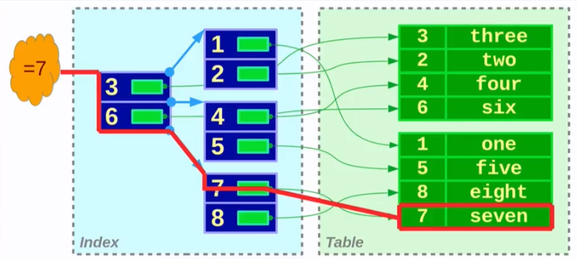

# BASES DE DATOS RELACIONALES CON POSTGRESQL Y PGADMIN

## Una introducción a las bases de datos

### ¿Qué es una base de datos?

Una base de datos (BD) es un sistema organizado para almacenar, gestionar y recuperar información de manera eficiente. Es un archivo digital gigante donde se pueden hacer búsquedas, filtrar datos, relacionar información y protegerla.

Hay distintos tipos de bases de datos dependiendo de cómo se organiza la información:

1. **Relacionales (SQL)**:
    - Organizan la información en tablas (como hojas de Excel). Cada tabla contiene filas (registros) y columnas (atributos o campos).
    - Usan un lenguaje llamado SQL (Structured Query Language) para consultar datos.
    - _Ejemplos: PostgreSQL, MySQL, Oracle, SQL Server._

2. **No relacionales (NoSQL)**:
    - No usan tablas estrictas; pueden ser documentos, gráficos o pares clave-valor.
    - _Ejemplos: MongoDB, Redis, Cassandra._
    
3. **Otras categorías**:
    - NewSQL: mezcla de SQL tradicional con escalabilidad moderna.
    - Bases de datos en memoria: enfocadas en velocidad, como Redis.

En nuestro caso utilizaremos las **bases de datos relacionales**. La idea principal de estas bases de datos es que las tablas pueden relacionarse entre sí usando claves (keys), lo que permite:
- Evitar duplicar información.
- Mantener la integridad y coherencia de los datos.
- Hacer consultas complejas que unan varias tablas.

Son como un gran Excel con filas y columnas que contienen distinto tipo de información que puede accederse.

## PostgreSQL: sistema de gestión de bases de datos relacional de código abierto (el "almacén físico" de los datos)

PostgreSQL es un sistema de gestión de bases de datos relacional (RDBMS) de código abierto. Se encarga de almacenar, organizar y permitir consultas sobre los datos. Es el “almacén físico” de información. Los datos por tanto se almacenan en tablas con filas y columnas.

Soporta SQL estándar y muchas funciones avanzadas:
- Tipos de datos complejos: JSON, ARRAY, UUID
- Índices avanzados: GIN, GiST, BRIN
- Transacciones ACID confiables
- Procedimientos almacenados y triggers
- Extensiones como PostGIS para datos geoespaciales

Se utiliza para cualquier aplicación que necesite almacenar, consultar y manipular datos de manera confiable.

### Estructura básica de una base de datos relacional en PostgreSQL

En PostgreSQL, la estructura típica es:

| id_cliente | nombre | email                                     |
| ---------- | ------ | ----------------------------------------- |
| 1          | Ana    | [ana@email.com](mailto:ana@email.com)     |
| 2          | Pedro  | [pedro@email.com](mailto:pedro@email.com) |

1. **Base de datos (Database)**: Contenedor principal que almacena toda la información.
2. **Esquemas (Schema)**: Subcarpetas dentro de la BD que ayudan a organizar tablas, vistas y funciones.
3. **Tablas (Tables)**: Donde se almacena la información en filas y columnas.
    - **Fila (registro)**: Cada fila representa un dato completo o instancia (_Ejemplo: Ana con su email es un registro único_).
    - **Columna (campo)**: definen qué tipo de información se almacena (_Ejemplo: `nombre` es un atributo de tipo texto, `id_cliente` es un número entero único_).
4. **Vistas (Views)**: Consultas guardadas como tablas virtuales.
5. **Índices (Indexes)**: Estructuras que aceleran las búsquedas.
6. **Claves (Keys)**:
    - **Primary Key**: identificador único de cada fila (_ejemplo: `id_cliente`_)
    - **Foreign Key**: relaciona tablas entre sí (_Ejemplo: en tabla ventas, `id_cliente` apunta a `clientes.id_cliente`_).
7. **Relaciones**:
    - Las relaciones conectan tablas. Tipos más comunes:
        - **Uno a uno (1:1)**: Cada fila de una tabla se relaciona con exactamente una fila de otra.
        - **Uno a muchos (1:N)**: Una fila de una tabla puede relacionarse con varias filas de otra.
            - _Ejemplo: un cliente puede tener muchas ventas._
        - **Muchos a muchos (N:M)**: Varias filas de una tabla pueden relacionarse con varias filas de otra.
            - _Ejemplo: estudiantes y cursos._

### Ejemplo de uso relacional

1. Tabla clientes:

| id_cliente | nombre |
| ---------- | ------ |
| 1          | Ana    |
| 2          | Pedro  |

2. Tabla productos:

| id_producto | nombre   | precio |
| ----------- | -------- | ------ |
| 1           | Camisa   | 20     |
| 2           | Pantalón | 30     |

3. Tabla ventas:

| id_venta | id_cliente | id_producto | cantidad |
| -------- | ---------- | ----------- | -------- |
| 1        | 1          | 2           | 1        |
| 2        | 2          | 1           | 3        |

Aquí podemos relacionar tablas:
- Ana compró un pantalón → ventas.id_cliente = clientes.id_cliente y ventas.id_producto = productos.id_producto.
- Sin tablas relacionadas, tendríamos que repetir el nombre del cliente y del producto en cada venta, lo cual es muy ineficiente.

### ¿Cómo se accede a una base de datos?

Hay varias formas de interactuar con una base de datos:
1. **Interfaz gráfica**: Herramientas visuales que permiten ver y editar datos sin escribir mucho código.
    - _Ejemplo: **pgAdmin**, DBeaver._
2. **Línea de comandos (CLI)**: Usando psql en PostgreSQL
    - _Ejemplo: SELECT * FROM clientes._
3. **Desde un programa**: Aplicaciones pueden conectarse a la BD usando drivers o librerías en **Python**, Java, PHP, etc.

## pgAdmin: interfaz gráfica para el acceso y la edición de bases de datos relacionales (el "control remoto visual" de los datos)

pgAdmin es una herramienta gráfica (panel de control) para acceder al sistema de gestión de la base de datos relacional en PostgreSQL de forma sencilla y sin necesidad de escribir comando SQL directamente. Permite:
- Crear bases de datos y tablas visualmente.
- Ejecutar consultas SQL de forma fácil. 
- Administrar usuarios y permisos.
- Visualizar relaciones y estructuras de las tablas.

Por tanto, esta herramienta evita escribir todos los comandos desde cero, y permite hacer las ediciones y modificaciones de la base de datos desde una interfaz fácil de utilizar sin necesidad de hacerlo vía código.

### Tipos de objetos de PostgreSQL en pgAdmin – Tabla Resumen

- **Schemas (esquemas)**: son el lugar principal donde trabajas con tablas, vistas y funciones.
- **Catalogs (catálogos)**: contienen información interna de PostgreSQL, no se suelen modificar.
- **Extensions y FDW**: añaden funcionalidades y acceso a datos externos.
- **Publications / Subscriptions**: para replicación de datos entre bases de datos.
- **Roles**: controlan quién ve y hace qué dentro de la base de datos.
- **Tablespaces**: opcional para controlar almacenamiento físico.

| Objeto                                     | Qué es                                                                                                           | Cómo crear / gestionar (Ejemplo)                                                                                                                                                                                                                                                           | Cuándo / Por qué usarlo                                                                                                                 |
| ------------------------------------------ | ---------------------------------------------------------------------------------------------------------------- | ------------------------------------------------------------------------------------------------------------------------------------------------------------------------------------------------------------------------------------------------------------------------------------------ | --------------------------------------------------------------------------------------------------------------------------------------- |
| **Casts**                                  | Reglas que definen la conversión automática o explícita entre tipos de datos                                     | `CREATE CAST (integer AS text) WITH FUNCTION int_to_text(integer) AS IMPLICIT;`                                                                                                                                                                                                            | Para que PostgreSQL convierta automáticamente tipos en consultas (por ejemplo, de entero a texto). Raramente se crean manualmente.      |
| **Catalogs (Catálogos)**                   | Tablas de metadatos del sistema que almacenan información sobre tablas, columnas, roles y permisos               | Solo consultar, ejemplo: `SELECT * FROM pg_class WHERE relkind = 'r';`                                                                                                                                                                                                                     | Para usuarios avanzados que necesitan información interna de la BD, monitoreo o tareas de administración. No se modifican directamente. |
| **Event Triggers (Triggers de evento)**    | Triggers a nivel de base de datos que se ejecutan en eventos DDL (CREATE, ALTER, DROP)                           | `CREATE EVENT TRIGGER trg_ddl ON ddl_command_end EXECUTE PROCEDURE log_ddl_changes();`                                                                                                                                                                                                     | Para automatizar auditorías, registros o acciones personalizadas cuando cambian objetos de esquema.                                     |
| **Extensions (Extensiones)**               | Módulos que agregan funciones, tipos u operadores adicionales a PostgreSQL                                       | `CREATE EXTENSION IF NOT EXISTS postgis;`                                                                                                                                                                                                                                                  | Para añadir funcionalidades como GIS (mapas), generación de UUID, búsqueda de texto completo, etc.                                      |
| **Foreign Data Wrappers (FDW)**            | Permiten que PostgreSQL consulte fuentes externas (otras bases de datos, archivos) como si fueran tablas locales | `sql CREATE EXTENSION postgres_fdw; CREATE SERVER foreign_srv FOREIGN DATA WRAPPER postgres_fdw OPTIONS (host 'host'); CREATE USER MAPPING FOR CURRENT_USER SERVER foreign_srv OPTIONS (user 'u', password 'p'); IMPORT FOREIGN SCHEMA public FROM SERVER foreign_srv INTO local_schema; ` | Integrar datos externos sin moverlos, permitiendo consultas federadas.                                                                  |
| **Languages (Lenguajes)**                  | Lenguajes procedurales para escribir funciones o procedimientos almacenados                                      | `CREATE LANGUAGE plpython3u;`                                                                                                                                                                                                                                                              | Para crear funciones almacenadas en PL/pgSQL (por defecto), Python, Perl, etc., con lógica más avanzada dentro de la BD.                |
| **Publications (Publicaciones)**           | Definen conjuntos de tablas o datos para replicación lógica                                                      | `CREATE PUBLICATION my_pub FOR TABLE my_table;`                                                                                                                                                                                                                                            | Para configurar replicación, indicando qué cambios de datos se envían a suscriptores.                                                   |
| **Schemas (Esquemas)**                     | Espacios de nombres dentro de la base de datos que agrupan tablas, vistas y funciones                            | `CREATE SCHEMA sales AUTHORIZATION user1;`                                                                                                                                                                                                                                                 | Organizar objetos, evitar conflictos de nombres y gestionar permisos. Todas las tablas existen dentro de un esquema.                    |
| **Subscriptions (Suscripciones)**          | Suscripciones a publicaciones para recibir datos replicados                                                      | `CREATE SUBSCRIPTION my_sub CONNECTION 'host=...' PUBLICATION my_pub;`                                                                                                                                                                                                                     | Para configurar bases de datos que reciben datos de otras mediante replicación.                                                         |
| **Tablespaces (Espacios de tablas)**       | Ubicaciones físicas de almacenamiento de los objetos de la base de datos                                         | `CREATE TABLESPACE fastspace LOCATION '/mnt/fast_ssd';`                                                                                                                                                                                                                                    | Para controlar dónde se almacenan tablas e índices, útil para rendimiento o gestión de disco.                                           |
| **Login / Group Roles (Roles / Usuarios)** | Usuarios y grupos que controlan acceso y permisos                                                                | `CREATE ROLE readonly LOGIN PASSWORD 'secret'; GRANT SELECT ON ALL TABLES IN SCHEMA public TO readonly;`                                                                                                                                                                                   | Gestionar quién puede conectarse y qué acciones puede realizar. Esencial para seguridad y entornos multiusuario.

## Los comandos y funciones más importantes en PostgreSQL

## Comandos en SQL


## Ejemplo de comandos básicos

Referencia del ejemplo: **_Learn Basic SQL in 3.5 hrs | Complete SQL Beginner Course_** https://www.youtube.com/watch?v=S86phsLFW1E

Al ejecutar estos comandos en pgAdmin, si seleccionamos con el ratón una línea o conjunto de líneas en concreto y le damos a ejecutar, se ejecutará únicamente esa parte del código y no toda la query completa que tengamos escrita. Esto permite en una query con distintos comandos seleccionar cuales queremos ejecutar.

La estructura general que podemos utilizar es cuando tenemos que llevar a cabo una _query_ es:

```sql
select -- nombre de la(s) columna(s) que queremos mostrar (originales o transformadas)
from -- nombre de la(s) tabla(s) con los dato que queremos
inner join -- unimos el resto de tablas necesarias utilizando un indicador único que conecte las tablas (solo se mostrarán las filas que tengan codigos que coincidan)
    -- left join: devuelve un inner join y todas las filas de la primera tabla
    -- right join: devuelve un inner join y todas las filas de la segunda tabla
where -- condiciones a cumplir por la(s) columna(s)
group by -- cuando queremos mostrar columnas con categorías únicas, debemos previamente agruparlas en sus categorías únicas
order by -- ordenamos las columnas, en orden acendente por default o "desc" en orden descendente 
```

**Ejemplo 1**: Mostrar el nombre del cliente, el nombre del empleado y el monto total de la venta de todos los pedidos que estén en estado de espera o pendientes:

1. seleccionamos las columnas de las distintas tablas que queremos mostrar, tanto originales como calculadas (suma)
2. Tenemos que unir las 4 tablas ("sales_order", "employees", "products", "customers") vía "inner join" utilizando un identificador único para las tablas
3. Como mostramos los datos finales por nombre de cliente y empleado, los agrupamos en sus valores únicos con "group by"
4. Para la condición utilizamos el "where" para filtrar los valores que queremos mostrar.

En SQL se utilizan "alias" para que sean más fáciles de tratar las tablas (se ponen al final de las tablas dentro del "from").

```sql
select c.name as customer, e.name as employee, sum(so.quantity * p.price) as total_sale
from sales_order so
inner join employees e on so.emp_id = e.id
inner join products p on so.prod_id = p.id
inner join customers c on so.customer_id = c.id
where so.status in ('On Hold', 'Pending')
group by c.name, e.name
```

A continuación algunos de los comandos más importantes a utilizar:

```sql
------------------------------------------------
-- Create a new table called "products" in our database
------------------------------------------------
create table products
(
	product_code	int,
	product_name	varchar(50),
	price			float,
	released_date	date
);

------------------------------------------------
-- Show table values
------------------------------------------------
select * from products;

------------------------------------------------
-- Insert values in the table
------------------------------------------------
insert into products (product_code, product_name, price, released_date) 
values (1, 'iPhone 15', 999.5, to_date('22-08-2023','dd-mm-yyyy'));
insert into products (product_code, product_name, price, released_date) 
values (1, 'Macbook Pro 16', 2000, to_date('25-07-2021','dd-mm-yyyy'));
insert into products (product_code, product_name, price, released_date) 
values (1, 'AirPods', 400, to_date('02-02-2022','dd-mm-yyyy'));

------------------------------------------------
-- Seleccionar unos valores concretos en la tabla
------------------------------------------------
-- Seleccionamos la fila con un precio > 1000
select * from products
where price > 1000;
-- Seleccionamos únicamente el nombre concreto del producto con un precio > 1000
select product_name from products
where price > 1000;
-- Seleccionamos únicamente el nombre concreto del producto con un precio > 1000
-- Además le damos un alias a la columna (solo para la visualización) y al alias le damos la letra p
select product_name as product from products p
where price > 1000;
-- Seleccionamos únicamente la columna "product_code"
select product_code from products;
-- Seleccionamos la fila cuyo año en la fecha es 2023
select * from products
where to_char(released_date,'yyyy') = '2023'
-- Manera alternativa de seleccional la fila cuyo año es 2023  
select * from products
where extract(year from released_date) = '2023'

------------------------------------------------
-- Contar el número de filas que cumplen una condición
------------------------------------------------
select count(*) from products
where price > 1000;

------------------------------------------------
-- Obtener el valor (suma, media) de una cierta columna (e.g.: "price")
------------------------------------------------
select sum(price) from products
select avg(price) from products

------------------------------------------------
-- Modificar los datos en una tabla con "update"
------------------------------------------------
update products
set price = 1200, released_date = to_date('2023-08-30','yyyy-mm-dd')
where product_name = 'iPhone 15';

update products
set price = 2000
where product_name like 'Macbook%' -- El "%" sirve para considerar cualquier carácter después de "Macbook" 

update products
set price = 2000
where product_name like '%15%' -- Equivalente a lo anterior, pero buscando cualquier fila (record) que contenga un 15 

select * from products;

------------------------------------------------
-- Eliminar datos de una tabla con "delete" (o "truncate" para eliminar rápidamente toda la tabla)
------------------------------------------------
delete from products
where product_name like '%iPhone%'

-- Eliminar filas duplicadas utilizando el identificador oculto "ctid" (único para cada fila)

DELETE FROM products a -- products a and b are two copies of the same table
USING products b
WHERE a.ctid > b.ctid -- ensures we don't match a row with itself
  AND a.product_code = b.product_code
  AND a.product_name = b.product_name
  AND a.price = b.price
  AND a.released_date = b.released_date;

select * from products;

------------------------------------------------
-- Creamos una tabla duplicada (como "back-up") con el comando "create"
------------------------------------------------
create table products_bkp
as
select * from products;

-- Podemos crear una tabla duplicada donde solo tengamos la estructura pero no los valores dentro de la tabla

create table products_bkp2
as
select * from products
where 1 = 2; -- Esta condición es obviamente falsa, por eso solo creamos la estructura

select * from products_bkp2;

------------------------------------------------
-- Queremos borrar una tabla de la base de datos utilizando "drop"
-- "drop" elimina la tabla completa de la base de datos mientras que "delete"/"truncate" solo elimina los datos dentro de la tabla
------------------------------------------------
drop table products;

-- Para evitar errores al eliminar tablas que no existen podemos utilizar el "if exists"
drop table if exists products;

------------------------------------------------
-- Modificar la estructura de una tabla
------------------------------------------------
-- Renombrar una tabla (la tabla "products_bkp" obviamente dejará de existir)
alter table products_bkp rename to products;

-- Renombrar una columna
alter table products rename column product_code to id;

-- Modificar el tipo de dato de una columna
alter table products alter column id type float;

------------------------------------------------
-- "Primary/Composite (more than one) key constrains": añadir restricciones a algunas de las columnas de nuestra tabla, para evitar repeticiones
------------------------------------------------
drop table if exists products;
create table products
(
	product_code	int primary key, -- hemos considerado a esta columna como "primary key". No podremos tener duplicados
	product_name	varchar(50),
	price			float,
	released_date	date
);
-- Forma alternativa de fijar una columna (o más de una, razón de este método) como "primary key"
create table products
(
	product_code	int,
	product_name	varchar(50),
	price			float,
	released_date	date,
	constraint pk_prod primary key (product_code, product_name) -- llamamos al constraint como "pk_prod" y lo asignamos a una (o más) columna específica
); 

insert into products (product_code, product_name, price, released_date) 
values (1, 'iPhone 15', 999.5, to_date('22-08-2023','dd-mm-yyyy'));
insert into products (product_code, product_name, price, released_date) 
values (2, 'Macbook Pro 16', 2000, to_date('25-07-2021','dd-mm-yyyy'));
insert into products (product_code, product_name, price, released_date) 
values (3, 'AirPods', 400, to_date('02-02-2022','dd-mm-yyyy'));

select * from products

------------------------------------------------
-- "Identity constrains": cuando sabemos qué columna debe ser única, de esta manera SQL asignará directamente un valor único
------------------------------------------------
drop table if exists products;
create table products
(
	product_code	int generated always as identity, -- hemos considerado a esta columna como "primary key". No podremos tener duplicados
	product_name	varchar(50),
	price			float,
	released_date	date
);
-- Definimos la columna "identity" como "default" para que SQL asigne números únicos
insert into products (product_code, product_name, price, released_date) 
values (default, 'iPhone 15', 999.5, to_date('22-08-2023','dd-mm-yyyy'));
insert into products (product_code, product_name, price, released_date) 
values (default, 'Macbook Pro 16', 2000, to_date('25-07-2021','dd-mm-yyyy'));
insert into products (product_code, product_name, price, released_date) 
values (default, 'AirPods', 400, to_date('02-02-2022','dd-mm-yyyy'));

select * from products

------------------------------------------------
-- "Foreign key constraint": 
------------------------------------------------
-- Creamos una nueva tabla
create table sales_order
(
	order_id	int generated always as identity primary key,
	order_date	date,
	quantity	int,
	prod_id		int,
	status		varchar(30)
);

insert into sales_order (order_id, order_date, quantity, prod_id, status) 
values (default, to_date('01-01-2024','dd-mmm-yyyy'), 2, 1, 'Completed');
insert into sales_order (order_id, order_date, quantity, prod_id, status) 
values (default, to_date('01-01-2024','dd-mmm-yyyy'), 1, 2, 'Pending');
insert into sales_order (order_id, order_date, quantity, prod_id, status) 
values (default, to_date('01-01-2024','dd-mmm-yyyy'), 1, 15, 'Completed'); -- prod_id = 15 no existe en la primera tabla

-- la tabla "sales_order" solo puede tener ids que existen en la tabla "products", por eso necesitamos crear una relación padre-hijo entre tablas
drop table if exists sales_order
create table sales_order
(
	order_id	int generated always as identity primary key,
	order_date	date,
	quantity	int,
	prod_id		int references products(product_code), -- los ids de la tabla "sales_order" solo pueden ser aquellos que aparezcan en "products"
	status		varchar(30)
);

insert into sales_order (order_id, order_date, quantity, prod_id, status) 
values (default, to_date('01-01-2024','dd-mmm-yyyy'), 2, 1, 'Completed');
insert into sales_order (order_id, order_date, quantity, prod_id, status) 
values (default, to_date('01-01-2024','dd-mmm-yyyy'), 1, 2, 'Pending');
insert into sales_order (order_id, order_date, quantity, prod_id, status) 
values (default, to_date('01-01-2024','dd-mmm-yyyy'), 1, 15, 'Completed'); -- prod_id = 15 no existe en la primera tabla

select * from products;
select * from sales_order;
```

### CASE STUDY: 20 preguntas en SQL

Referencia: **_Learn Basic SQL in 3.5 hrs | Complete SQL Beginner Course_** https://www.youtube.com/watch?v=S86phsLFW1E

Primero de todo definimos las tablas que vamos a utilizar

```sql
_____________________________________
(1) DEFINIMOS LAS TABLAS QUE VAMOS A UTILIZAR
_____________________________________

drop table if exists products;
create table products
(
	id				    int generated always as identity primary key,
	name			    varchar(100),
	price			    float,
	release_date 	date
);
insert into products 
values(default,'iPhone 15', 800, to_date('22-08-2023','dd-mm-yyyy'));
insert into products 
values(default,'Macbook Pro', 2100, to_date('12-10-2022','dd-mm-yyyy'));
insert into products 
values(default,'Apple Watch 9', 550, to_date('04-09-2022','dd-mm-yyyy'));
insert into products 
values(default,'iPad', 400, to_date('25-08-2020','dd-mm-yyyy'));
insert into products 
values(default,'AirPods', 420, to_date('30-03-2024','dd-mm-yyyy'));

drop table if exists customers;
create table customers
(
    id         int generated always as identity primary key,
    name       varchar(100),
    email      varchar(30)
);
insert into customers values(default,'Meghan Harley', 'mharley@demo.com');
insert into customers values(default,'Rosa Chan', 'rchan@demo.com');
insert into customers values(default,'Logan Short', 'lshort@demo.com');
insert into customers values(default,'Zaria Duke', 'zduke@demo.com');

drop table if exists employees;
create table employees
(
    id         int generated always as identity primary key,
    name       varchar(100)
);
insert into employees values(default,'Nina Kumari');
insert into employees values(default,'Abrar Khan');
insert into employees values(default,'Irene Costa');

drop table if exists sales_order;
create table sales_order
(
	order_id		  int generated always as identity primary key,
	order_date	  date,
	quantity		  int,
	prod_id			  int references products(id),
	status			  varchar(20),
	customer_id		int references customers(id),
	emp_id			  int,
	constraint fk_so_emp foreign key (emp_id) references employees(id)
);
insert into sales_order 
values(default,to_date('01-01-2024','dd-mm-yyyy'),2,1,'Completed',1,1);
insert into sales_order 
values(default,to_date('01-01-2024','dd-mm-yyyy'),3,1,'Pending',2,2);
insert into sales_order 
values(default,to_date('02-01-2024','dd-mm-yyyy'),3,2,'Completed',3,2);
insert into sales_order 
values(default,to_date('03-01-2024','dd-mm-yyyy'),3,3,'Completed',3,2);
insert into sales_order 
values(default,to_date('04-01-2024','dd-mm-yyyy'),1,1,'Completed',3,2);
insert into sales_order 
values(default,to_date('04-01-2024','dd-mm-yyyy'),1,3,'completed',2,1);
insert into sales_order 
values(default,to_date('04-01-2024','dd-mm-yyyy'),1,2,'On Hold',2,1);
insert into sales_order 
values(default,to_date('05-01-2024','dd-mm-yyyy'),4,2,'Rejected',1,2);
insert into sales_order 
values(default,to_date('06-01-2024','dd-mm-yyyy'),5,5,'Completed',1,2);
insert into sales_order 
values(default,to_date('06-01-2024','dd-mm-yyyy'),1,1,'Cancelled',1,1);

SELECT * FROM products;
SELECT * FROM customers;
SELECT * FROM employees;
SELECT * FROM sales_order;
```

A continuación contestamos a las 20 preguntas en relación a las tablas creadas:

```sql
_____________________________________
(1) Identify the total no of products
_____________________________________

SELECT sum(quantity) as total_sold_products
FROM sales_order

_____________________________________
(2) Other than completed, display the available delivery status
_____________________________________

-- Estrutura general de las queries
select status  -- mention all the columns
from sales_order -- the table which has the data
where status -- filter condition

select status  -- mention all the columns
from sales_order -- the table which has the data
where status not in ('Completed', 'completed'); -- filter condition

-- si solo queremos seleccionar los status distintos (sin repeticiones)
select distinct status  -- mention all the columns
from sales_order -- the table which has the data
where status not in ('Completed', 'completed'); -- filter condition

-- si tenemos texto en mayúsculas o minúsculas, para que no nos de error podemos convertirlo
select status
from sales_order
where upper(status) <> 'COMPLETED'; -- transformamos toda la columna a mayúsculas y por tanto ahora no tendremos discrepancias

_____________________________________
(3) Display the order id, order_date and product_name for all completed orders
_____________________________________

select order_id, order_date, name -- queremos obtener datos de dos tablas diferentes, por tanto tenemos que unirlas utilizando un identificador único
from sales_order so -- damos un alias "so" a la tabla "sales_order"
inner join products p on p.id = so.prod_id -- unimos ambas tablas
where upper(so.status) = 'COMPLETED';

_____________________________________
(4) Sort the above query to show the earliest orders at the top.
	Also display the customer who purchased these orders
_____________________________________

select order_id, order_date, p.name, c.name -- cuando en varias tablas el nombre de una columna es igual, tenemos que especificar de qué tabla proviene el nombre
from sales_order so -- damos un alias "so" a la tabla "sales_order"
inner join products p on p.id = so.prod_id
inner join customers c on so.customer_id = c.id
where upper(so.status) = 'COMPLETED'
order by order_date asc -- Ordenamos por data ascendente (esta es la menera estandard de ordenar en SQL)  

_____________________________________
(5) Display the total no of orders corresponding to each delivery status
_____________________________________

-- Aggregate functions: COUNT, SUM, AVG, MIN, MAX
-- GROUP BY: cuando queramos mostrar los datos agrupados en las distintas categorías que pueda tener una columna

select status, count(*) as total_orders
from sales_order
group by status 

_____________________________________
(6) For orders purchasing more than 1 item, how many are still not completed?
_____________________________________

select count(*) as not_completed_count -- Here we want just a total number, that's why the don't select one of the columns to show (as we did before)
from sales_order so
where quantity > 1 
and upper(status) <> 'completed'

_____________________________________
(7) Find the total no of orders corresponding to each delivery status
	by ignoring the case in delivery status.
	Status with highest no of orders should be at the top
_____________________________________

-- FIRST SOLUTION TO THE PROBLEM:
-- First of all we create the subquery for "ignoring upper of lower cases in the delivery status"
-- We will then enter this sub query in the "from", because we need somehow a transformed version of the "sales_order" table
select status
case when status = 'completed'
			then 'Completed' -- we enter this part only when the above condition in the when is true
		else status
	end as updated_status
from sales_order;

select updated_status, count(*) as total_orders -- We should select from the "updated_status" new table (instead than from the "status" one)
from (select status,
			case when status = 'completed'
				then 'Completed' -- we enter this part only when the above condition in the when is true
			else status
		end as updated_status
	from sales_order) sq -- We give the alias "subquery" to this transformation
group by updated_status
order by total_orders desc;

-- SECOND SOLUTION TO THE PROBLEM (EASIEST)
-- Simplemente ponemos todos los valores de la columna status en minúscula, y de esta forma los hacemos semejantes
select lower(status), count(*) as total_orders
from sales_order
group by lower(status)
order by total_orders desc;

_____________________________________
(8) Write a query to identify the total products purchased by each customer
_____________________________________

select c.name as customer_name, sum(so.quantity) as total_purchased_products
from sales_order so
inner join customers c on c.id = so.customer_id
group by c.name -- Queremos el total por cliente, entonces hacemos que sea un grupo de los distintos clientes que tenemos

_____________________________________
(9) Display the total sales and average sales done for each day
_____________________________________

select order_date, sum(quantity * price) as total_sales, avg(quantity * price) as average_sales -- Seleccionamos las columnas concretas que queremos mostrar (calculadas o no)
from sales_order so
inner join products p on p.id = so.prod_id
group by order_date
order by order_date;

_____________________________________
(10) Display the customer name, employee name and total sale amount of all orders
	which are either on hold or pending
_____________________________________

select c.name as customer, e.name as employee, sum(so.quantity * p.price) as total_sale -- Queremos mostrar tanto el nombre del cliente como del empleado (por eso los agruparemos con "group by") y las ventas totales para cada uno calculadas
from sales_order so -- Como sales_order es la tabla que contiene todos los códigos que permiten unir las otras tablas, tenemos que ponerla la primera
inner join employees e on so.emp_id = e.id -- Unimos todas las tablas de las que necesitamos información
inner join products p on so.prod_id = p.id
inner join customers c on so.customer_id = c.id
where so.status in ('On Hold', 'Pending') -- Aplicamos la condición
group by c.name, e.name -- Como queremos mostrar los datos por cliente y empleado, con el "group by" podemos agruparlos en valores únicos a mostrar 

_____________________________________
(11) Fetch all the orders which were neither completed/pending or where handled by the employee Abrar. 
	Display employee name and all details or order.
_____________________________________

select e.name as employee, so.*
from sales_order so
inner join employees e on e.id = so.emp_id
where lower(status) not in ('completed', 'pending')
or lower(e.name) like '%abrar%'; -- Si utilizáramos "and" significaría que ambas condiciones son ciertas. En nuestro caso es "or": una o la otra.

_____________________________________
(12) Fetch the orders which cost more than 2000 but did not include the macbook pro.
	Print the total sale amount as well.
_____________________________________

select order_id, quantity, price, (quantity * price) as total_cost
from sales_order so
inner join products p on p.id = so.prod_id
where (quantity * price) > 2000 -- Añadimos la primera condición
and lower(p.name) not like '%macbook%' -- Añadimos la segunda condición con "and" (ambas deben cumplirse)

_____________________________________
(13) Identify the customers who have not purchased any product yet
_____________________________________

-- FIRST SOLUTION TO THE PROBLEM:
-- Resolvemos el problema utilizando una subquery
-- Primero definimos la condición
select distinct customer_id
from sales_order

-- Ahora introducimos la condición para obtener lo que se nos pide
select * from customers
where id not in (select distinct customer_id
				from sales_order) -- La subquery dentro del paréntesis

-- SECOND SOLUTION TO THE PROBLEM: use "left join"
-- "Left join": lleva a cabo un "inner join" y junta toda la primera tabla.
select c.*
from customers c
left join sales_order so on so.customer_id = c.id
where so.order_id is null;

-- Podemos hacerlo con "right join". Como queremos mantener la tabla de "customers" que es la que nos interesa podemos hacer un right join y ponerla segunda entonces
select c.*
from sales_order so
right join customers c on so.customer_id = c.id
where so.order_id is null;

_____________________________________
(14) Write a query to identify the total products purchased by each customer.
	Return all customers irrespective of whether they have made a purchase or not.
	Sort the result with highest no of orders at the top.
_____________________________________
select c.name, coalesce(sum(quantity),0) as total_prod_purchased -- Transformamos los valores nulos en 0 con la función "coalesce"
from sales_order so
right join customers c on c.id = so.customer_id -- Para poder mostrar a todos los "clientes" independientement de si han hecho una compra o no ("right join") 
group by c.name
order by total_prod_purchased desc;

_____________________________________
(15) Corresponding to each employee, display the total sales they made of all the completed orders.
	Display total sales as 0 if an employee made no sales yet.
_____________________________________
select e.name as employee, coalesce(sum(quantity * price),0) as total_sale
from sales_order so
inner join products p on p.id = so.prod_id
right join employees e 
	on e.id = so.emp_id
	and lower(status) = 'completed'
group by e.name

_____________________________________
(16) Re-write the above query so as to display the total sales made by each employee corresponding to each customer.
	If an employee has not served a customer yet then display "-" under the customer.
_____________________________________
select e.name as employee, coalesce(c.name, '-') as customer, 
coalesce(sum(quantity * price),0) as total_sale
from sales_order so
inner join products p on p.id = so.prod_id
inner join customers c on c.id = so.customer_id
right join employees e 
	on e.id = so.emp_id
	and lower(status) = 'completed'
group by e.name, c.name
order by 1,2;

_____________________________________
(17) Re-write above query so as to display only those records where the total sales is above 1000
_____________________________________
-- Cuando tenemos una claúsula "group by" tenemos que utilizar el "having" porque el "where" no permite introducir condiciones cuando los datos están agrupados
select e.name as employee, coalesce(c.name, '-') as customer, 
coalesce(sum(quantity * price),0) as total_sale
from sales_order so
inner join products p on p.id = so.prod_id
inner join customers c on c.id = so.customer_id
right join employees e 
	on e.id = so.emp_id
	and lower(status) = 'completed'
group by e.name, c.name
having coalesce(sum(quantity * price), 0) > 1000
order by 1,2; -- Ordenamos los datos por columna 1 y 2

_____________________________________
(18) Identify employees who have served more than 2 customers.
_____________________________________
select e.name as employee, count(distinct(c.name)) as customer
from sales_order so
inner join employees e on e.id = so.emp_id
inner join customers c on c.id = so.customer_id
group by e.name
having count(distinct(c.name)) > 2
order by 1

_____________________________________
(19) Identify the customers who have purchased more than 5 products
_____________________________________
select c.name as customer, sum(so.quantity) as total_products
from sales_order so
inner join customers c on c.id = so.customer_id
group by c.name
having sum(so.quantity) > 5;

_____________________________________
(20) Identify the customers whose average purchase cost exceeds the average sale of all the orders
_____________________________________
-- Hacemos primero la subquery donde calculamos la venta media total
select avg(quantity * price)
from sales_order so
inner join products p on p.id = so.prod_id;

-- Aquí calculamos el coste medio por cliente (por tanto tenemos que agruparlos con "group by") y comparar con la venta media total antes calculada
select c.name as customer, avg(quantity * price)
from sales_order so
inner join customers c on c.id = so.customer_id
inner join products p on p.id = so.prod_id
group by c.name
having avg(quantity * price) > (select avg(quantity * price)
								from sales_order so
								inner join products p on p.id = so.prod_id)
```

## Funciones en PostgreSQL (algunas comunes a SQL, otras solo propias de PostgreSQL)

| Función                                          | Tipo            | Descripción                        | Ejemplo                                                          |
| ------------------------------------------------ | --------------- | ---------------------------------- | ---------------------------------------------------------------- |
| LENGTH(text)                                     | Cadenas         | Devuelve la longitud de la cadena  | `LENGTH('Hola') → 4`                                             |
| LOWER(text)                                      | Cadenas         | Convierte a minúsculas             | `LOWER('Hola') → 'hola'`                                         |
| UPPER(text)                                      | Cadenas         | Convierte a mayúsculas             | `UPPER('Hola') → 'HOLA'`                                         |
| TRIM(text)                                       | Cadenas         | Quita espacios al inicio y final   | `TRIM('  Hola  ') → 'Hola'`                                      |
| SUBSTRING(text FROM start FOR length)            | Cadenas         | Extrae subcadena                   | `SUBSTRING('Hola Mundo',6,5) → 'Mundo'`                          |
| POSITION(substring IN string)                    | Cadenas         | Devuelve la posición de substring  | `POSITION('Mundo' IN 'Hola Mundo') → 6`                          |
| CONCAT(text,...)                                 | Cadenas         | Une varias cadenas                 | `CONCAT('Hola',' ','PG') → 'Hola PG'`                            |
| REPLACE(string,from,to)                          | Cadenas         | Reemplaza subcadena                | `REPLACE('Hola Mundo','Mundo','PostgreSQL') → 'Hola PostgreSQL'` |
| SPLIT_PART(string,delimiter,field)               | Cadenas         | Devuelve parte de cadena separada  | `SPLIT_PART('a,b,c',',',2) → 'b'`                                |
| LEFT(text,n)                                     | Cadenas         | Primeros n caracteres              | `LEFT('Hola',2) → 'Ho'`                                          |
| RIGHT(text,n)                                    | Cadenas         | Últimos n caracteres               | `RIGHT('Hola',2) → 'la'`                                         |
| INITCAP(text)                                    | Cadenas         | Inicial mayúscula de cada palabra  | `INITCAP('hola mundo') → 'Hola Mundo'`                           |
| LPAD(text,length,fill)                           | Cadenas         | Rellena a la izquierda             | `LPAD('5',3,'0') → '005'`                                        |
| RPAD(text,length,fill)                           | Cadenas         | Rellena a la derecha               | `RPAD('5',3,'0') → '500'`                                        |
| TO_CHAR(value, format)                           | Cadenas/Fechas  | Convierte números o fechas a texto | `TO_CHAR(NOW(),'YYYY-MM-DD') → '2026-01-15'`                     |
| ABS(number)                                      | Numéricas       | Valor absoluto                     | `ABS(-5) → 5`                                                    |
| ROUND(number,decimals)                           | Numéricas       | Redondea                           | `ROUND(3.1415,2) → 3.14`                                         |
| CEIL(number)                                     | Numéricas       | Redondea hacia arriba              | `CEIL(3.2) → 4`                                                  |
| FLOOR(number)                                    | Numéricas       | Redondea hacia abajo               | `FLOOR(3.7) → 3`                                                 |
| POWER(base,exp)                                  | Numéricas       | Eleva a potencia                   | `POWER(2,3) → 8`                                                 |
| SQRT(number)                                     | Numéricas       | Raíz cuadrada                      | `SQRT(16) → 4`                                                   |
| MOD(a,b)                                         | Numéricas       | Resto de división                  | `MOD(10,3) → 1`                                                  |
| RANDOM()                                         | Numéricas       | Número aleatorio 0-1               | `RANDOM() → 0.7345`                                              |
| GREATEST(val1,val2,...)                          | Lógica/Numérica | Devuelve el mayor                  | `GREATEST(5,10,3) → 10`                                          |
| LEAST(val1,val2,...)                             | Lógica/Numérica | Devuelve el menor                  | `LEAST(5,10,3) → 3`                                              |
| WIDTH_BUCKET(expression,min,max,buckets)         | Numéricas       | Clasifica valor en bucket          | `WIDTH_BUCKET(15,0,100,5) → 1`                                   |
| NOW()                                            | Fecha/Hora      | Fecha y hora actual                | `NOW() → 2026-01-15 12:34`                                       |
| CURRENT_DATE                                     | Fecha/Hora      | Solo fecha actual                  | `CURRENT_DATE → 2026-01-15`                                      |
| CURRENT_TIME                                     | Fecha/Hora      | Solo hora actual                   | `CURRENT_TIME → 12:34:56`                                        |
| AGE(timestamp,timestamp)                         | Fecha/Hora      | Diferencia entre fechas            | `AGE('2026-01-15','2025-01-15') → 1 year`                        |
| EXTRACT(field FROM timestamp)                    | Fecha/Hora      | Extrae año, mes, día, etc.         | `EXTRACT(MONTH FROM NOW()) → 1`                                  |
| DATE_TRUNC('unit',timestamp)                     | Fecha/Hora      | Redondea fecha a unidad            | `DATE_TRUNC('month',NOW()) → 2026-01-01`                         |
| TO_DATE(text,format)                             | Fecha/Hora      | Convierte texto a fecha            | `TO_DATE('15-01-2026','DD-MM-YYYY') → 2026-01-15`                |
| TO_TIMESTAMP(text,format)                        | Fecha/Hora      | Convierte texto a timestamp        | `TO_TIMESTAMP('15/01/2026 12:30','DD/MM/YYYY HH24:MI')`          |
| INTERVAL                                         | Fecha/Hora      | Sumar o restar tiempo              | `NOW() + INTERVAL '2 days'`                                      |
| COUNT(column)                                    | Agregada        | Cuenta filas                       | `COUNT(*)`                                                       |
| SUM(column)                                      | Agregada        | Suma valores                       | `SUM(price)`                                                     |
| AVG(column)                                      | Agregada        | Promedio valores                   | `AVG(price)`                                                     |
| MIN(column)                                      | Agregada        | Valor mínimo                       | `MIN(price)`                                                     |
| MAX(column)                                      | Agregada        | Valor máximo                       | `MAX(price)`                                                     |
| STRING_AGG(column,delimiter)                     | Agregada        | Une valores en cadena              | `STRING_AGG(product_name, ', ')`                                 |
| ARRAY_AGG(column)                                | Agregada/Array  | Devuelve array de valores          | `ARRAY_AGG(product_name)`                                        |
| JSON_AGG(column)                                 | Agregada/JSON   | Devuelve JSON de filas             | `JSON_AGG(product_name)`                                         |
| BOOL_AND(column)                                 | Agregada/Lógica | True si todos son true             | `BOOL_AND(active)`                                               |
| BOOL_OR(column)                                  | Agregada/Lógica | True si alguno es true             | `BOOL_OR(active)`                                                |
| COALESCE(value,default)                          | Lógica          | Devuelve primer valor no nulo      | `COALESCE(NULL,5) → 5`                                           |
| NULLIF(a,b)                                      | Lógica          | Devuelve NULL si a=b               | `NULLIF(5,5) → NULL`                                             |
| CASE WHEN ... THEN ... ELSE ... END              | Lógica          | Expresión condicional              | `CASE WHEN price>10 THEN 'Alto' ELSE 'Bajo' END`                 |
| ARRAY[...]                                       | Array           | Crea array                         | `ARRAY[1,2,3]`                                                   |
| UNNEST(array)                                    | Array           | Convierte array en filas           | `UNNEST(ARRAY[1,2,3])`                                           |
| ARRAY_LENGTH(array,dim)                          | Array           | Longitud de array                  | `ARRAY_LENGTH(ARRAY[1,2,3],1) → 3`                               |
| ARRAY_APPEND(array,element)                      | Array           | Añade elemento                     | `ARRAY_APPEND(ARRAY[1,2],3) → {1,2,3}`                           |
| TO_JSON(value)                                   | JSON            | Convierte valor a JSON             | `TO_JSON(10) → 10`                                               |
| JSON_BUILD_OBJECT(key,value,...)                 | JSON            | Crea objeto JSON                   | `JSON_BUILD_OBJECT('name','Widget','price',10.5)`                |
| ->                                               | JSON            | Acceso a clave JSON                | `data->'name'`                                                   |
| ->>                                              | JSON            | Acceso a clave JSON como texto     | `data->>'price'`                                                 |
| GENERATE_SERIES(start,stop,step)                 | Especial        | Genera serie de números o fechas   | `SELECT * FROM GENERATE_SERIES(1,5)`                             |
| ROW_NUMBER() OVER(PARTITION BY ... ORDER BY ...) | Especial        | Numeración de filas                | `ROW_NUMBER() OVER(PARTITION BY product_code ORDER BY price)`    |
| RANK() OVER(PARTITION BY ... ORDER BY ...)       | Especial        | Ranking de filas                   | `RANK() OVER(PARTITION BY active ORDER BY price)`                |
| DENSE_RANK() OVER(PARTITION BY ... ORDER BY ...) | Especial        | Ranking sin huecos                 | `DENSE_RANK() OVER(PARTITION BY active ORDER BY price)`          |
| UUID_GENERATE_V4()                               | Especial        | Genera UUID                        | `SELECT uuid_generate_v4();`                                     |

### Acceso eficiente a series temporales con PostgreSQL

**_Efficient Time Series with PostgreSQL - Steve Simpson_** https://www.youtube.com/watch?v=atvgYJTBEF4

#### Indexado

Cada vez que hacemos una petición con PostgreSQL tenemos que recorrer toda la base de datos. Esto es poco eficiente. Para evitar tener que recorrer toda la base de datos podemos utilizar el indexado. Hay varios tipos.

1. **BTREE** (árbol balanceado): es una estructura de datos que mantiene los valores ordenados y permite buscar, insertar y eliminar datos en tiempo logarítmico (O(log n)). Esta estructura es especialmente útil en:

    - Búsquedas por igualdad `WHERE id = 10`
    - Comparaciones por rango `WHERE fecha BETWEEN '2025-01-01' AND '2025-01-31'`
    - Ordenamientos `ORDER BY name`
    


**Ejemplo**:

```sql
-- Creamos el índice:
CREATE INDEX idx_orders_customer_date
ON orders (customer_id, order_date) USING BTREE (email);

-- Llevamos a cabo una query donde utilizamos el índice (podemos verificar la utilización del índice con "EXPLAIN ANALYZE")
EXPLAIN ANALYZE
SELECT *
FROM orders
WHERE customer_id = 42
  AND order_date BETWEEN '2024-06-01' AND '2024-06-30'
ORDER BY order_date;
```

Utilizar demasiados índices puede ser contraproducente. En este caso podemos utilizar normalización.

#### Normalización

La normalización es un proceso de diseño de bases de datos que consiste en organizar los datos en tablas bien estructuradas, eliminando redundancia y dependencias incorrectas, para mejorar consistencia, mantenibilidad y eficiencia. 

En PostgreSQL (y en general en bases de datos relacionales), la normalización impacta directamente en la eficiencia de las queries, especialmente cuando se combina con índices (BTREE) y JOINs bien definidos.

**Ejemplo**:

1. Diseño no normalizado: 

```sql
-- Creamos la tabla completa 
CREATE TABLE orders_bad (
    order_id SERIAL PRIMARY KEY,
    customer_name TEXT,
    customer_email TEXT,
    order_date DATE,
    total NUMERIC
);

-- Query (ineficiente: `customer_name` y `customer_email` se repiten miles de veces. Actualizar un email requiere múltiple updates.)
SELECT *
FROM orders_bad
WHERE customer_email = 'ana@email.com'
  AND order_date >= '2025-01-01';
```

2. Diseño normalizado: creamos dos tablas diferentes que podemos unir eficientemente

```sql
-- Creamos las tablas:
-- (1) Tabla de clientes:
CREATE TABLE customers (
    id SERIAL PRIMARY KEY,
    name TEXT NOT NULL,
    email TEXT NOT NULL UNIQUE
);
-- (2) Tabla de órdenes:
CREATE TABLE orders (
    id SERIAL PRIMARY KEY,
    customer_id INT NOT NULL REFERENCES customers(id),
    order_date DATE NOT NULL,
    total NUMERIC
);

-- Creamos los índices (claves para la eficiencia)
CREATE INDEX idx_orders_customer_date
ON orders (customer_id, order_date);

CREATE INDEX idx_customers_email
ON customers (email);

-- Query equivalente a la anterior
SELECT o.*
FROM orders o
JOIN customers c ON c.id = o.customer_id
WHERE c.email = 'ana@email.com'
  AND o.order_date >= '2025-01-01';
```
En este segundo ejemplo, ¿qué pasa internamente?

1. PostgreSQL busca el cliente por `email`
→ Index Scan (BTREE) sobre `customers.email`

2. Obtiene `customer_id` (entero)

3. Busca órdenes por `customer_id` + fecha
→ Index Scan en `orders`

4. JOIN rápido usando PK/FK

## Python: para conectarse e interactuar directamente con la base de datos relacional de PostgreSQL

### Flujo típico de trabajo:

1. Instalamos PostgreSQL en el ordenador (o usas un servidor remoto).
    - Buscamos “PostgreSQL” en las extensiones de VS Code (hay una oficial llamada “PostgreSQL” de Microsoft o `vscode-database`).
    - Nos conectamos a la base de datos configurando el host, puerto (`5432` por defecto), usuario, contraseña y base de datos
2. Creamos una base de datos y tablas (utilizando **pgAdmin** o VS Code con Python).
    - Conectas nuestro script Python usando `psycopg2` o SQLAlchemy. Esto nos permitirá leer, actualizar y escribir datos en la bse de datos.
(*) Otra manera de inspeccionar y modificar los datos es a través de la interfaz **pgAdmin**.

### Comandos y funciones más importantes en Python para trabajar con PostgreSQ

#### Conectar con PostgreSQL

Para trabajar con PostgreSQL desde Python normalmente usamos **SQLAlchemy** o **psycopg2**.

1. Con **SQLAlchemy**

**SQLAlchemy** no es ni un sistema de gestión de bases de datoss relacionales (como PostgreSQL) ni una interfaz visual (como PGAdmin), sino un ORM (Object-Relational Mapper) y toolkit de SQL para Python. Su función principal es permitir interactuar con bases de datos desde Python de manera sencilla y programática. SQLAlchemy te permite tratar tablas y filas de la base de datos como si fueran clases y objetos de Python.

```python
from data_sql import _get_engine  # importamos la función para acceso a la base de datos de otro script
eng = _get_engine()               # crea el engine de conexión
conn = eng.raw_connection()       # conexión a bajo nivel
cur = conn.cursor()               # cursor para ejecutar SQL
```
- `_get_engine()` → Devuelve un engine de SQLAlchemy que se conecta a PostgreSQL.
- `conn.raw_connection()` → Devuelve la conexión nativa para ejecutar comandos SQL.
- `cursor()` → Permite ejecutar consultas SQL (SELECT, INSERT, UPDATE, etc.). Es como un puntero o un "dedo" que recorre y ejecuta órdenes dentro de la base de datos. El cursor se utiliza para:
    - Ejecutar SQL:
    ```python
    cur.execute("SELECT * FROM metrics")
    ```
    
    - Leer resultados. El cursos guarda internamente el resultado y te lo entrega cuando lo pides:
    ```python
    cur.fetchall() # todas las filas
    cur.fetchone() # una fila
    cur.fetchmany(10) # varias filas
    ```
    
    - Manejar grandes volumenes de datos: los seleccionamos todos, y luego con el for vamos uno a uno. Permite no cargar todo en memoria y leer fila a fila:
    ```python
    cur.execute("SELECT * FROM values")
    for row in cur:
        print(row)
    ```
    
    - Para controlar transacciones. El cursor trabaja dentro de una transacción:     
    ```python
    cur.execute("INSERT INTO metrics ...")
    ```

De [data_sql.py](data_sql.py) estamos importando la función `_get_engine()`. 

```python
from sqlalchemy import create_engine, text

[...]

def _get_engine():
    """Singleton del engine SQLAlchemy usando config/database.yaml."""
    global _engine  # De momento está sin fijar
    if _engine is None:
        cfg = read_config(CONFIG / "database.yaml")
        conn_str = get_connection_string(**cfg)
        _engine = create_engine(conn_str)
    return _engine
```

Esta función:  
- Lee la configuración de la base de datos desde un YAML.

```python
engine: "postgresql"
driver: "psycopg2"
username: "postgres"
password: "postgres"
host: "10.32.7.60"
database: "series"
```
- Crea un engine de SQLAlchemy con esa configuración.
- Guarda ese engine en _engine para reutilizarlo y no crear múltiples conexiones.
- Siempre devuelve el mismo engine cuando se llama.

2. Con **`psycopg2`**

```python
import psycopg2
conn = psycopg2.connect(
    dbname="mi_db",
    user="usuario",
    password="contraseña",
    host="localhost",
    port="5432"
)
cur = conn.cursor() # Inicializamos el cursor
```

En vez de escribir todos los parámetros, podríamos también utilizar un archivo `.yaml` como antes.

#### Ejemplo con los comandos más importantes:

| Categoría              | Comando / Función                      | Uso                                    |
| ---------------------- | -------------------------------------- | -------------------------------------- |
| Conexión               | `_get_engine()` / `psycopg2.connect()` | Conectar Python con PostgreSQL         |
| Cursor                 | `conn.cursor()`                        | Ejecutar consultas SQL inicializando el cursor                |
| Selección              | `cur.execute("SELECT ...", params)`    | Leer datos                             |
| Insertar               | `cur.execute("INSERT INTO ...")`       | Insertar registros                     |
| Insertar con conflicto | `cur.execute("ON CONFLICT ... DO UPDATE")`            | Evitar duplicados y actualizar         |
| Actualizar             | `cur.execute("UPDATE ...")`            | Cambiar datos existentes               |
| Eliminar               | `cur.execute("DELETE ...")`            | Borrar registros                       |
| Confirmar cambios      | `conn.commit()`                        | Guardar cambios en la BD               |
| Revertir cambios       | `conn.rollback()`                      | Deshacer cambios si hay error          |
| Cerrar conexión        | `conn.close()`                         | Finalizar sesión con BD                |

Referencia del ejemplo: **_Connect to PostgreSQL from Python (Using SQL in Python) | Python to PostgreSQL_** https://www.youtube.com/watch?v=M2NzvnfS-hI

```python
# ==============================
# Ejemplo de Python + PostgreSQL
# Crear tabla en base de datos, 
# añadir y modificar valores de la tabla
# ==============================

import psycopg2

# DETALLES DE LA CONEXIÓN A LA BASE DE DATOS (normalmente lo pondremos en un archivo.yaml)

hostname = 'localhost'
database = ' demo'
username = 'postgres'
pwd = 'admin'
port_id = 5432

# FIJAMOS VARIABLES DE CONEXIÓN COMO NONE INCIIALMENTE
conn = None
cur = None

# NOS CONECTAMOS A LA BASE DE DATOS UTILIZANDO PSYCOPG2
# UTILIZAMOS UN BLOQUE TRY EXCEPT PARA CAPTURAR ERRORES
try:
    conn = psycopg2.connect(
                host = hostname,
                dbname = database,
                user = username,
                password = pwd,
                port = port_id)

    # CREAMOS UN CURSOR PARA EJECUTAR COMANDOS SQL
    cur = conn.cursor()

    # --------------------
    # DENTRO DE UNA DATABASE EXISTENTE VAMOS A CREAR UNA NUEVA TABLA ("employees") QUE MODIFICAREMOS CON COMANDOS SQL
    # El procedimiento es: creamos una variable con el comando SQL, luego la ejecutamos con el cursor
    # guardamos los cambios con conn.commit()
    # --------------------

    # (1) CREAMOS LA TABLA
    create_script = """CREATE TABLE IF NOT EXISTS employees (
                        id      int PRIMARY KEY,
                        name    varchar(40) NOT NULL,
                        salary  int,
                        dept_id varchar(30)"""
    cur.execute(create_script)

    # (2) AÑADIMOS DATOS A LA TABLA
    insert_script = """INSERT INTO employees (id, name, salary, dept_id) VALUES (%s, %s, %s, %s)"""
    insert_values = [
        (1, "Alice", 30000, "HR"),
        (2, "Bob", 25000, "IT"),
        (3, "Charlie", 35000, "Finance")
    ] # Diccionario de tuplas con los valores a insertar

    # Ejecutamos el insert para cada tupla en la lista para insertarlos en la base de datos
    for record in insert_values:
        cur.execute(insert_script, record)
    
    # (3) SELECCIONAR TODOS LOS DATOS DE LA TABLA (Y MOSTRARLOS POR PANTALLA)
    cur.execute("SELECT * FROM employees")
    cur.fetchall()  # Recuperamos todos los registros
    print(cur.fetchall())  # Mostramos los registros por pantalla8

    # Para mostrarlos uno a uno:
    for record in cur.fetchall():
        print(record)

    # (4) MODIFICAMOS DATOS EN LA TABLA
    update_script = """UPDATE employees SET salary = salary + (salary * 0.5)"""
    cur.execute(update_script)

    # (5) BORRAMOS UN REGISTRO DE LA TABLA
    delete_script = """DELETE FROM employees WHERE name = %s"""
    delete_record = ("Bob", ) # Tupla con el valor concreto a borrar
    cur.execute(delete_script, delete_record)

    # (6) GUARDAMOS TODOS LOS CAMBIOS EN LA BASE DE DATOS
    conn.commit()
    
except Exception as error:
    print(error)
# AÑADIMOS UN "FINALLY BLOCK" PARA ASEGURARNOS DE CERRAR LA CONEXIÓN
finally:
    if cur is not None:
        cur.close()
    if conn is not None:
        conn.close()
```
## Arquitectura de series temporales en bases de datos: jerarquía, métricas y valores (par valor-fecha)

Para gestionar correctamente las series temporales, utilizamos un modelo relacional de **tres capas**. Este sistema organiza los datos de lo general a lo particular, permitiendo que la información sea fácil de navegar y visualizar.

### Capa 1: Jerarquía (`hierarchy`)
Es el **sistema de carpetas**. Su función es agrupar las métricas para que no estén "sueltas" en la base de datos.

* **Cómo funciona**: Define la ubicación lógica en un árbol de directorios (carpetas y subcarpetas).
* **Ejemplo Real**: La carpeta raíz se llama `metricas bancos`. Dentro, podemos tener subcarpetas como `ingresos_netos_intereses`.
* **Dato clave**: Cada carpeta tiene un **ID único**. Si cambias el nombre en el archivo YAML (por ejemplo, de `EBA_Metrics` a `EBA Metrics`), el sistema no reconocerá la carpeta anterior y creará una nueva, duplicando la estructura.

### Capa 2: Métricas (`metrics`)
Es la **definición del dato**. Aquí es donde decimos "qué" estamos midiendo, pero todavía no incluimos los números.

* **Relación**: Cada métrica está "colgada" de una carpeta de la jerarquía mediante el campo `hierarchy_id`.
* **Ejemplo Real**: La métrica `MB.ingresos_netos_intereses.SAN`:
    * **Nombre técnico**: `MB.ingresos_netos_intereses.SAN` (es el código que usa el programa para identificarla unívocamente).
    * **Nombre amigable (Dimensiones)**: `{"name": "Santander"}` (es lo que el usuario final verá en la aplicación o gráfico).

### Capa 3: Valores (`values`)
Es el **dato numérico final** unido a una línea de tiempo (fecha).

* **Estructura**: Cada fila registra un valor real cruzando una métrica específica con una fecha determinada.
* **Ejemplo Real**:
    * **Métrica**: `MB.ingresos_netos_intereses.SAN` (Ingresos netos por intereses de Santander).
    * **Fecha**: `2023-12-31`.
    * **Valor**: `1250.80`.
* **Protección**: Gracias a la restricción de **unicidad**, si vuelves a subir el mismo dato para la misma fecha, el sistema realizará un "Upsert": **sobreescribirá** el valor anterior en lugar de crear una fila duplicada.

### ¿Cómo conecta esto con el archivo YAML?

El archivo `.yaml` actúa como el **manual de instrucciones** para construir estas capas:

1. **Lectura de Carpetas**: El script de jerarquía lee las claves principales del YAML para crear los registros en la **Capa 1**.
2. **Mapeo de Nombres**: Toma los códigos (ej. `MB.ingresos_netos_intereses.SAN`) y sus descripciones (ej. "Santander") para rellenar la **Capa 2**.
3. **Carga desde Excel**: El script de carga usa el YAML como diccionario. Busca el nombre de la columna en el Excel, mira a qué métrica del YAML corresponde, y guarda el número en la **Capa 3** con el ID de métrica correcto.

#### Ejemplo del archivo `estructura_metricas_bancos.yaml`

```yaml
metricas bancos:
  ingresos_netos_intereses:
    MB.ingresos_netos_intereses.SAN: "Santander"
    MB.ingresos_netos_intereses.BBVA: "BBVA"
    MB.ingresos_netos_intereses.CABK: "CaixaBank"
    MB.ingresos_netos_intereses.SAB: "Sabadell"
    MB.ingresos_netos_intereses.BKT: "Bankinter"
    MB.ingresos_netos_intereses.UNI: "Unicaja"

  ingresos_netos_intereses_esp:
    MB.ingresos_netos_intereses_esp.SAN: "Santander (España)"
    MB.ingresos_netos_intereses_esp.BBVA: "BBVA (España)"
    [...]
```

### Resumen Visual del Ejemplo
1. **Capa 1**: Carpeta "ingresos_netos_intereses" (parent_id = 68, que es el id de "metricas bancos" y al cual pertenecen todas las subcarpetas de hierarchy).
2. **Capa 2**: Métrica "ROE Santander" (ID: 500, vinculada a hierarchy_id = 68, la subcarpeta de "metricas bancos" a la que pertenece).
3. **Capa 3**: Valor "12.5" (vinculado a metric_id = 500 el día 31/12/2023).

```sql
-- Table "hierarchy": defines tree structure/folders --> Key Column: "id" --> References: N/A

-- Table "metrics": defines the specific series (e.g.: ROE for Spain) --> Key Column: "hierarchy_id" --> References: hierarchy.id

-- Table "values": stores the actual values and dates for each metric --> Key Column: "metric_id" --> References: metrics.id

---------------------------------------------------

-- SQL Query to join "values" and "metrics" tables:
    SELECT
        v.*,
        m.name, m.id
    FROM values v
    JOIN metrics m
        ON v.metric_id = m.id;
```
## Migraciones de base de datos con Alembic

### ¿Qué es una migración?

Una migración es un archivo con instrucciones SQL que describe un **cambio concreto en la estructura** de la base de datos (crear una tabla, añadir una columna, modificar un tipo de dato...). Cada migración tiene:

- Un **upgrade**: el SQL para aplicar el cambio.
- Un **downgrade**: el SQL para deshacerlo.

Estos archivos se guardan en el repositorio git junto al resto del código. Así, el historial de cambios de la estructura de la base de datos queda versionado exactamente igual que el código.

### ¿Por qué usar migraciones?

Cuando modificamos la base de datos directamente desde pgAdmin (o cualquier otra herramienta), cada cambio se aplica directamente y **no queda registrado en ningún sitio**. Esto genera problemas:

| Sin migraciones | Con migraciones |
|---|---|
| Cambios directos sin registro | Cada cambio es un archivo en git |
| Imposible reproducir el entorno | `alembic upgrade head` reconstruye toda la BD |
| Sin vuelta atrás | `alembic downgrade -1` deshace el último cambio |
| Sin coordinación | Git muestra quién cambió qué y cuándo |

### ¿Qué herramienta usamos?

**Alembic** es la herramienta que gestiona las migraciones. Mantiene una tabla interna en la base de datos (`alembic_version`) con el identificador de la última migración aplicada. Cuando le pides que actualice, compara esa tabla con los archivos que hay en la carpeta de migraciones y ejecuta los que falten, en orden.

### Importante: migraciones vs. subida de datos

Las migraciones gestionan **cambios en la estructura** (DDL: CREATE TABLE, ALTER TABLE, ADD COLUMN...), **no la subida de datos**. Los scripts de subida de datos (`upload_series_EBA.py`, `upload_series_metricas_bancos.py`, etc.) siguen funcionando exactamente igual que antes. Son cosas independientes:

| Qué | Quién lo hace | Ejemplo |
|---|---|---|
| Cambios de estructura (esquema) | Migraciones Alembic | Añadir una columna `description` a la tabla `metrics` |
| Subida de datos (filas) | Scripts de upload existentes | Insertar valores de EBA desde un Excel |

### Estructura de archivos de Alembic en este proyecto

```
database_servidor/
├── alembic.ini                          # Configuración de Alembic
├── alembic/
│   ├── env.py                           # Lee la conexión del .env + database.yaml
│   ├── script.py.mako                   # Plantilla para nuevas migraciones
│   └── versions/                        # Aquí viven las migraciones
│       └── 0001_initial_schema.py       # Baseline: tablas actuales
```

- **`alembic.ini`**: archivo de configuración general. No hace falta tocarlo.
- **`alembic/env.py`**: lee la conexión a la base de datos desde los mismos archivos que ya usa el proyecto (`.env` y `config/database.yaml`), así no hay que duplicar la configuración.
- **`alembic/script.py.mako`**: plantilla que Alembic usa para generar nuevos archivos de migración.
- **`alembic/versions/`**: carpeta donde se almacenan todas las migraciones. Cada archivo es un cambio concreto en la estructura de la base de datos.

### La migración inicial: `0001_initial_schema.py`

La primera migración del proyecto es especial. No introduce ningún cambio nuevo — es una **foto de cómo están las tablas hoy**. Su función es servir de punto de partida para que todas las migraciones futuras se encadenen a partir de ella.

Su `upgrade()` contiene los `CREATE TABLE IF NOT EXISTS` de las 4 tablas actuales (`hierarchy`, `metrics`, `values`, `demo_series`), y su `downgrade()` las elimina en orden inverso.

Esta migración tiene **dos usos distintos** según el escenario:

| Escenario | Qué hacer | Qué ocurre |
|---|---|---|
| **Base de datos existente** (ya tiene las tablas) | `uv run --active alembic stamp 0001` | No ejecuta SQL. Solo marca `0001` como aplicada en `alembic_version`. Es un "bookmark". |
| **Base de datos nueva** (vacía, sin tablas) | `uv run --active alembic upgrade head` | Ejecuta el `upgrade()` y crea las 4 tablas desde cero. |

En nuestro caso (la BD ya existe), el comando es `stamp`, no `upgrade`.

### Ejemplo completo: añadir una columna a una tabla

Supongamos que queremos añadir una columna `description TEXT` a la tabla `metrics`. Este es el proceso completo paso a paso.

**1. Generar el archivo de migración:**

```bash
uv run --active alembic revision -m "add_description_to_metrics"
```

Esto crea un archivo nuevo en `alembic/versions/` con un nombre autogenerado, por ejemplo:

```
alembic/versions/a3f7b2c1d4e5_add_description_to_metrics.py
```

El archivo viene pre-rellenado desde la plantilla `script.py.mako`, con las funciones `upgrade()` y `downgrade()` vacías y un campo `down_revision` que apunta automáticamente a la migración anterior:

```python
revision: str = "a3f7b2c1d4e5"
down_revision: Union[str, None] = "0001"  # apunta a la migración anterior

def upgrade() -> None:
    pass

def downgrade() -> None:
    pass
```

**2. Editar el archivo con el SQL concreto:**

```python
def upgrade() -> None:
    op.execute("ALTER TABLE metrics ADD COLUMN description TEXT;")

def downgrade() -> None:
    op.execute("ALTER TABLE metrics DROP COLUMN description;")
```

**3. Aplicar la migración:**

```bash
uv run --active alembic upgrade head
```

Alembic se conecta a la BD, ve que `alembic_version` está en `0001`, encuentra la nueva migración `a3f7b2c1d4e5`, ejecuta su `upgrade()` (añade la columna) y actualiza `alembic_version` al nuevo hash.

**4. Guardar en git:**

```bash
git add alembic/versions/
git commit -m "migration: add description to metrics"
```

**Si quieres deshacerlo:**

```bash
uv run --active alembic downgrade -1
```

Ejecuta el `downgrade()` (elimina la columna) y mueve `alembic_version` de vuelta a `0001`.

**La cadena de migraciones queda así:**

```
0001_initial_schema.py                              (baseline, tablas actuales)
        │
        ▼
a3f7b2c1d4e5_add_description_to_metrics.py          (el nuevo cambio)
        │
        ▼
   ... futuras migraciones ...
```

**Resumen de qué se crea/modifica:**

| Qué | Acción |
|---|---|
| `alembic/versions/<hash>_add_description_to_metrics.py` | **Archivo nuevo** (creado por `alembic revision`, editado por ti) |
| Tabla `metrics` en la BD | Recibe la nueva columna al ejecutar `upgrade head` |
| Tabla `alembic_version` en la BD | Se actualiza de `0001` al nuevo hash |
| Todo lo demás | No se toca |

### Workflow: cómo hacer un cambio en la estructura de la base de datos

Cada vez que necesites modificar la estructura de la base de datos (añadir una tabla, una columna, cambiar un tipo de dato...), sigue estos cuatro pasos:

**Paso 1 — Crear la migración**

```bash
uv run --active alembic revision -m "descripcion_breve_del_cambio"
```

Esto genera un archivo Python nuevo en `alembic/versions/` con dos funciones vacías: `upgrade()` y `downgrade()`.

**Paso 2 — Escribir el SQL**

Abre el archivo generado y rellena las dos funciones. Por ejemplo, para añadir una columna `description` a la tabla `metrics`:

```python
def upgrade() -> None:
    op.execute("ALTER TABLE public.metrics ADD COLUMN description text;")

def downgrade() -> None:
    op.execute("ALTER TABLE public.metrics DROP COLUMN description;")
```

**Regla de oro**: el `downgrade` siempre debe dejar la BD exactamente como estaba antes del `upgrade`. Son operaciones inversas.

**Paso 3 — Aplicar la migración**

```bash
uv run --active alembic upgrade head
```

`head` significa "aplica todas las migraciones pendientes hasta la más reciente".

**Paso 4 — Guardar en git**

```bash
git add alembic/versions/
git commit -m "migration: descripcion del cambio"
```

### Comandos útiles

Todos los comandos llevan `uv run --active` delante:

| Comando | Qué hace |
|---|---|
| `alembic current` | Muestra en qué migración está la BD ahora mismo |
| `alembic history` | Lista todas las migraciones en orden |
| `alembic upgrade head` | Aplica todas las migraciones pendientes |
| `alembic upgrade +1` | Aplica solo la siguiente migración |
| `alembic downgrade -1` | Deshace la última migración aplicada |
| `alembic downgrade base` | Deshace todas las migraciones (deja la BD vacía de estructura) |
| `alembic stamp <revision>` | Marca una migración como aplicada sin ejecutarla (útil para bases de datos que ya existen) |

### Configuración inicial en una base de datos que ya tiene las tablas

Si la base de datos ya tiene las tablas creadas (que es nuestro caso), hay que decirle a Alembic que la migración inicial (`0001`) ya está aplicada, sin volver a ejecutarla:

```bash
uv run --active alembic stamp 0001
```

Esto crea la tabla `alembic_version` con el valor `0001`, indicando que esa migración ya fue aplicada. A partir de ahí, solo se ejecutarán las migraciones nuevas.

### Si algo sale mal

- Si una migración **falla a medias**, Alembic hace rollback automáticamente (deshace todo lo que hizo en esa migración). La BD queda en el estado anterior.
- Si una migración **se aplicó correctamente pero quieres deshacerla**, usa `alembic downgrade -1`.
- Si hay un **error en el SQL** de la migración, corrige el archivo y vuelve a ejecutar `alembic upgrade head`.

## Tutoriales en youtube

1. Cómo conectarse e interactuar con la base de datos a través de Python 

    **_Connect to PostgreSQL from Python (Using SQL in Python) | Python to PostgreSQL_** https://www.youtube.com/watch?v=M2NzvnfS-hI

2. Tutorial completo con Case Study de los comandos básicos en SQL

    **_Learn Basic SQL in 3.5 hrs | Complete SQL Beginner Course_** https://www.youtube.com/watch?v=S86phsLFW1E

3. Tratar de forma eficiente con grandes series temporales con PostgreSQL

    **_Efficient Time Series with PostgreSQL - Steve Simpson_** https://www.youtube.com/watch?v=atvgYJTBEF4